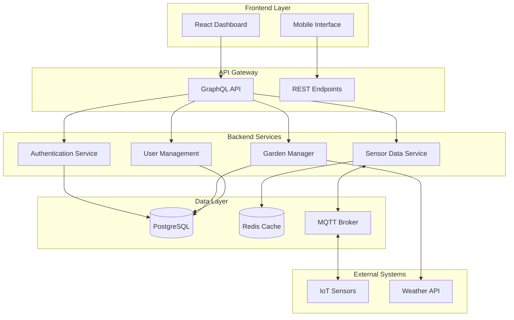

# 🌱 Orto - Smart Garden Management Platform

[](https://nestjs.com/)
[](https://reactjs.org/)
[](https://www.typescriptlang.org/)
[](https://graphql.org/)
[](https://www.docker.com/)
[](LICENSE)

> **A comprehensive SaaS platform for smart garden management with IoT sensor integration, automated care systems, and intelligent gardening insights.**

## 🚀 Overview

**Orto** is a full-stack Smart Garden Management platform designed for home gardeners who want to optimize plant health through technology. The platform transforms raw IoT sensor data into actionable gardening insights, reducing plant loss and increasing yields through intelligent automation.

### 🎯 Key Features

- **🏡 Multi-Garden Management**: Organize and manage multiple gardens with zone-based cultivation tracking
- **📊 IoT Sensor Integration**: Real-time monitoring of soil moisture, temperature, humidity, pH, and light levels
- **🤖 Smart Automation**: Intelligent watering schedules and care recommendations based on plant requirements
- **📈 Data Visualization**: Interactive charts and dashboards for monitoring garden health over time
- **🔔 Proactive Alerts**: Real-time notifications for care needs and environmental issues
- **🌿 Plant Database**: Species-specific care requirements and growth stage tracking

## 🏗️ Architecture

### Technology Stack

#### Backend (NestJS)
- **Framework**: NestJS 11.0.1 with Express.js
- **Language**: TypeScript 5.7.3 with SWC compiler
- **API**: GraphQL with Apollo Server
- **Authentication**: JWT with Passport.js strategies
- **Database**: PostgreSQL 17 with TypeORM
- **Caching**: Redis 7 for session management and performance
- **Testing**: Jest with e2e testing suite

#### Frontend (React)
- **Framework**: React 18.3.1 with TypeScript 5.5.3
- **Build Tool**: Vite 5.4.1 with SWC plugin
- **State Management**: TanStack Query (React Query) 5.56.2
- **UI Library**: shadcn/ui with Radix UI primitives
- **Styling**: Tailwind CSS 3.4.11 with custom design system
- **Forms**: React Hook Form 7.53.0 with Zod validation
- **Charts**: Recharts 2.12.7 for data visualization
- **Routing**: React Router DOM 6.26.2

#### Infrastructure
- **Database**: PostgreSQL 17-alpine
- **Cache**: Redis 7-alpine
- **Message Broker**: Eclipse Mosquitto 2.0 (MQTT)
- **Containerization**: Docker Compose
- **Admin Tools**: pgAdmin 4, Redis Commander

### System Architecture



## 🚦 Current Status

### ✅ Completed Features

#### Backend Architecture
- **Modular NestJS Structure**: Complete separation of concerns with dedicated modules
- **Authentication System**: JWT-based auth with role-based access control
- **GraphQL API**: Full CRUD operations for all entities
- **Database Design**: Optimized relational schema with proper indexing
- **Security**: Input validation, CORS, rate limiting, and secure password hashing

#### Core Modules
- **Users Module**: User management, profiles, and subscription handling
- **Auth Module**: JWT authentication, guards, and decorators
- **Gardens Module**: Garden and cultivation management with geolocation
- **Sensors Module**: IoT sensor integration with calibration and thresholds

#### Frontend Foundation
- **React Setup**: Modern React 18 with TypeScript and Vite
- **UI System**: Complete shadcn/ui component library (40+ components)
- **Apollo Integration**: GraphQL code generation and type-safe queries
- **Design System**: Consistent styling with Tailwind CSS

### 🚧 In Progress
- Frontend dashboard implementation
- Real-time sensor data visualization
- MQTT integration for live IoT data

### 📋 Roadmap
- Mobile-responsive interface completion
- Advanced analytics and insights
- Automated irrigation system integration
- Machine learning-based plant health predictions

## 🛠️ Getting Started

### Prerequisites

- **Node.js** 18+ and npm/pnpm
- **Docker** and Docker Compose
- **Git** for version control

### Quick Start

1. **Clone the repository**
   ```bash
   git clone https://github.com/Preppe/smart-garden.git
   cd smart-garden
   ```

2. **Environment Setup**
   ```bash
   # Copy environment template
   cp .env.example .env
   
   # Edit environment variables
   nano .env
   ```

3. **Start Infrastructure Services**
   ```bash
   # Start PostgreSQL, Redis, and MQTT broker
   docker-compose up -d
   ```

4. **Backend Setup**
   ```bash
   cd backend
   pnpm install
   pnpm start:dev
   ```

5. **Frontend Setup**
   ```bash
   cd frontend
   npm install
   npm run dev
   ```

6. **Access the Application**
   - **Frontend**: http://localhost:8080
   - **GraphQL Playground**: http://localhost:3000/graphql

## 📁 Project Structure

```
orto/
├── backend/                     # NestJS API Server
│   ├── src/
│   │   ├── auth/               # Authentication module
│   │   ├── users/              # User management
│   │   ├── gardens/            # Garden & cultivation logic
│   │   ├── sensors/            # IoT sensor integration
│   │   ├── config/             # Configuration files
│   │   └── main.ts             # Application entry point
│   ├── test/                   # E2E tests
│   └── package.json
├── frontend/                   # React SPA
│   ├── src/
│   │   ├── components/         # Reusable UI components
│   │   ├── pages/              # Route components
│   │   ├── graphql/            # GraphQL queries & mutations
│   │   ├── hooks/              # Custom React hooks
│   │   ├── stores/             # State management
│   │   └── lib/                # Utilities and configurations
│   └── package.json
├── mosquitto/                  # MQTT broker configuration
│   └── config/
├── memory-bank/                # Project documentation
├── docker-compose.yml          # Infrastructure stack
└── README.md
```

## 📊 API Documentation

### GraphQL Schema

The platform uses a comprehensive GraphQL API with the following main entities:

#### Core Types
```graphql
type User {
  id: ID!
  email: String!
  firstName: String!
  lastName: String!
  role: UserRole!
  subscriptionPlan: SubscriptionPlan!
  gardens: [Garden!]!
}

type Garden {
  id: ID!
  name: String!
  type: GardenType!
  location: GardenLocation
  cultivations: [Cultivation!]!
  sensors: [Sensor!]!
}

type Cultivation {
  id: ID!
  plantName: String!
  variety: String
  plantedDate: DateTime!
  growthStage: GrowthStage!
  sensors: [Sensor!]!
}

type Sensor {
  id: ID!
  name: String!
  type: SensorType!
  deviceId: String!
  unit: String!
  locationLevel: SensorLocationLevel!
  thresholds: SensorThresholds
  calibration: SensorCalibration
}
```

#### Example Queries
```graphql
# Get user gardens with cultivations
query GetUserGardens {
  getUserGardens {
    id
    name
    type
    cultivations {
      id
      plantName
      growthStage
      plantedDate
    }
  }
}

# Get garden sensors
query GetGardenSensors($gardenId: ID!) {
  getGardenSensors(gardenId: $gardenId) {
    id
    name
    type
    unit
    isActive
    thresholds {
      min
      max
      optimal_min
      optimal_max
    }
  }
}
```

#### Example Mutations
```graphql
# Create a new garden
mutation CreateGarden($input: CreateGardenInput!) {
  createGarden(input: $input) {
    id
    name
    type
    location {
      latitude
      longitude
      address
    }
  }
}

# Add sensor to garden
mutation CreateSensor($input: CreateSensorInput!) {
  createSensor(input: $input) {
    id
    name
    type
    deviceId
    locationLevel
  }
}
```

## 🧪 Development & Testing

### Code Quality
- **ESLint**: Strict TypeScript linting rules
- **Prettier**: Consistent code formatting
- **Husky**: Pre-commit hooks for quality checks

### Testing Strategy
```bash
# Backend testing
cd backend
pnpm test              # Unit tests
pnpm test:e2e          # End-to-end tests
pnpm test:cov          # Coverage report

# Frontend testing
cd frontend
npm test               # Component tests
npm run test:e2e       # E2E tests
```

### Development Commands
```bash
# Backend development
pnpm start:dev         # Hot reload development
pnpm start:debug       # Debug mode
pnpm build             # Production build

# Frontend development
npm run dev            # Development server
npm run build          # Production build
npm run preview        # Preview production build
npm run codegen        # Generate GraphQL types
```

## 🐳 Docker Deployment

### Production Deployment
```bash
# Build and start all services
docker-compose up -d

# View logs
docker-compose logs -f

# Scale services
docker-compose up -d --scale backend=3

# Stop services
docker-compose down
```

### Environment Configuration
```env
# Database
POSTGRES_DB=orto_db
POSTGRES_USER=orto_user
POSTGRES_PASSWORD=secure_password

# Redis
REDIS_PASSWORD=redis_password

# JWT
JWT_SECRET=your_jwt_secret_key
JWT_EXPIRES_IN=7d

# MQTT
MQTT_PORT=1883
MQTT_WS_PORT=9001
```

## 🔐 Security Features

- **JWT Authentication**: Secure token-based authentication
- **Role-Based Access Control**: Admin, moderator, and user roles
- **Input Validation**: Comprehensive data validation with class-validator
- **Password Security**: bcrypt hashing with salt rounds
- **CORS Protection**: Configurable cross-origin resource sharing
- **Rate Limiting**: API endpoint protection against abuse

## 📈 Performance Optimizations

- **Redis Caching**: Session management and frequently accessed data
- **Database Indexing**: Optimized queries with proper indexes
- **GraphQL Efficiency**: Field-level query optimization
- **Code Splitting**: Lazy-loaded React components
- **Image Optimization**: Compressed assets and lazy loading

## 🌐 IoT Integration

### MQTT Topics Structure
```
orto/{garden_id}/sensor/{sensor_type}/{zone_id}
├── temperature/     # Temperature readings
├── humidity/        # Humidity measurements
├── soil_moisture/   # Soil moisture levels
├── ph/             # pH measurements
├── light/          # Light intensity
└── air_quality/    # Air quality metrics
```

### Sensor Data Format
```json
{
  "sensor_id": "temp_001",
  "timestamp": "2024-01-15T10:30:00Z",
  "value": 23.5,
  "unit": "°C",
  "quality": "good",
  "battery_level": 85
}
```

## 🤝 Contributing

1. Fork the repository
2. Create a feature branch (`git checkout -b feature/amazing-feature`)
3. Commit your changes (`git commit -m 'Add amazing feature'`)
4. Push to the branch (`git push origin feature/amazing-feature`)
5. Open a Pull Request

### Development Guidelines
- Follow TypeScript strict mode
- Write comprehensive tests
- Update documentation
- Follow conventional commit messages

## 📄 License

This project is licensed under the MIT License - see the [LICENSE](LICENSE) file for details.

## 👨‍💻 Author

**Giuseppe** - Full-Stack Developer

- GitHub: [@yourusername](https://github.com/yourusername)
- LinkedIn: [Your LinkedIn](https://linkedin.com/in/yourprofile)
- Email: your.email@example.com

## 🙏 Acknowledgments

- **NestJS Team**: For the excellent backend framework
- **React Team**: For the powerful frontend library
- **shadcn**: For the beautiful UI component system
- **TypeScript Team**: For making JavaScript development enjoyable

---

⭐ **If you find this project interesting, please give it a star!** ⭐
