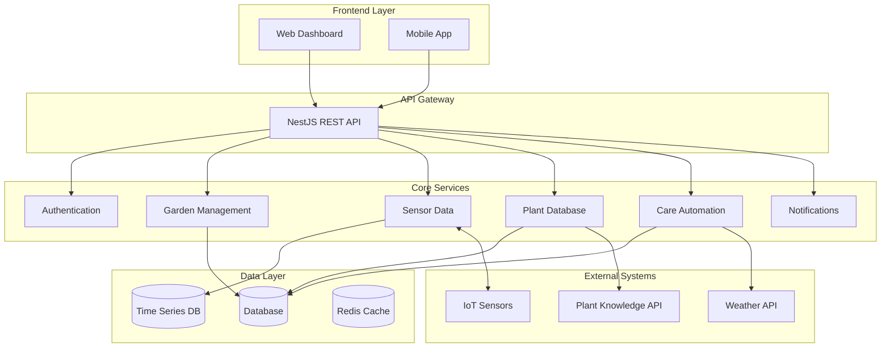

# System Patterns: Orto Smart Garden SaaS

## Architecture Overview
Modular system designed for gradual expansion from basic monitoring to full automation.



## Core Domain Models

### Garden Management
```typescript
interface Garden {
  id: string
  userId: string
  name: string
  location: GeoLocation
  type: 'indoor' | 'outdoor' | 'greenhouse'
  zones: Zone[]
  createdAt: Date
  updatedAt: Date
}

interface Zone {
  id: string
  gardenId: string
  name: string
  plants: Plant[]
  sensors: Sensor[]
  automationRules: AutomationRule[]
}
```

### IoT Sensor Integration
```typescript
interface Sensor {
  id: string
  zoneId: string
  type: SensorType
  deviceId: string
  status: 'active' | 'inactive' | 'error'
  lastReading: SensorReading
  calibration: CalibrationData
}

interface SensorReading {
  sensorId: string
  timestamp: Date
  value: number
  unit: string
  quality: 'good' | 'warning' | 'error'
}
```

### Plant Management
```typescript
interface Plant {
  id: string
  zoneId: string
  species: PlantSpecies
  plantedDate: Date
  currentStage: GrowthStage
  careSchedule: CareTask[]
  healthHistory: HealthRecord[]
}

interface PlantSpecies {
  id: string
  name: string
  commonName: string
  careRequirements: CareRequirements
  growthStages: GrowthStage[]
  optimalConditions: EnvironmentalConditions
}
```

## Key Design Patterns

### Modular Service Architecture
- **Microservice-Ready**: Each domain service can be extracted to separate microservice
- **Domain-Driven Design**: Clear boundaries between Garden, Sensor, Plant, and Care domains
- **Event-Driven**: Sensor readings trigger care recommendations and automation

### Data Processing Pipeline
```
IoT Sensors → Data Ingestion → Validation → Storage → Analysis → Actions
```

### Automation Rules Engine
```typescript
interface AutomationRule {
  id: string
  name: string
  triggers: Trigger[]
  conditions: Condition[]
  actions: Action[]
  isActive: boolean
}

interface Trigger {
  type: 'sensor_reading' | 'time_schedule' | 'plant_stage'
  parameters: Record<string, any>
}
```

## Technology Choices

### Backend Services
- **NestJS**: Modular architecture, dependency injection, TypeScript
- **TypeORM**: Database abstraction, migrations, relationships
- **Redis**: Caching sensor data, session management
- **InfluxDB**: Time-series data for sensor readings (future)

### Frontend Architecture
- **Component-Driven**: Shadcn/ui with Radix UI primitives for accessibility
- **Design System**: Consistent tokens with Tailwind CSS and custom themes
- **State Management**: React Query for server state, React hooks for local state
- **Real-time UI**: Simulated sensor updates with useEffect intervals
- **Responsive Design**: Mobile-first approach with CSS Grid and Flexbox
- **Chart Visualization**: Recharts for time-series sensor data display

### UI/UX Patterns
- **Glassmorphism**: Semi-transparent cards with backdrop blur effects
- **Progressive Disclosure**: Expandable components and nested information
- **Status Indicators**: Color-coded health metrics and alert systems
- **Interactive Controls**: Toggle switches for automation settings
- **Data Visualization**: Multi-line charts with tooltips and legends

### Real-time Features
- **WebSockets**: Live sensor data updates (prepared for MQTT integration)
- **Server-Sent Events**: Care alerts and notifications
- **Message Queue**: Async processing of sensor data (Redis/Bull)
- **Live Simulation**: 5-second interval updates for demo purposes

### External Integrations
- **IoT Protocols**: MQTT for sensor communication
- **Weather APIs**: Environmental context display
- **Plant Databases**: Species information and care guidelines

## Scalability Patterns

### Data Partitioning
- **User-based**: Gardens partitioned by userId
- **Time-based**: Sensor data partitioned by date ranges
- **Geographic**: Regional data distribution for weather integration

### Caching Strategy
- **Garden metadata**: Redis cache with TTL
- **Recent sensor readings**: In-memory cache for dashboards
- **Plant care rules**: Application-level cache with invalidation

### Monitoring & Observability
- **Health Checks**: Service and database health endpoints
- **Metrics**: Sensor data quality, API performance, user engagement
- **Logging**: Structured logging for debugging and analytics
